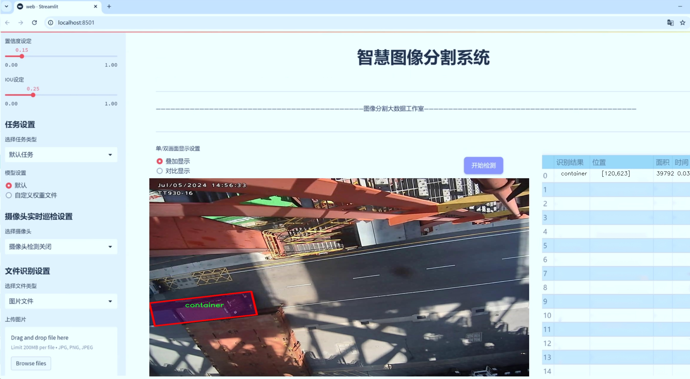
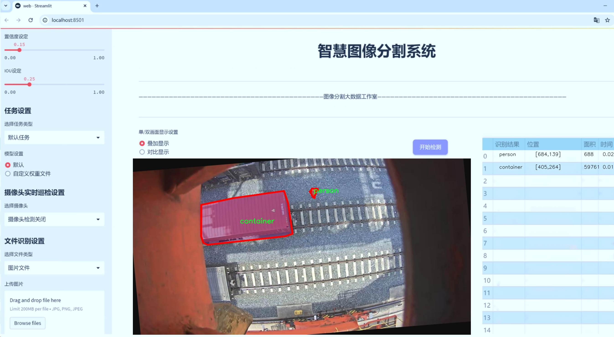
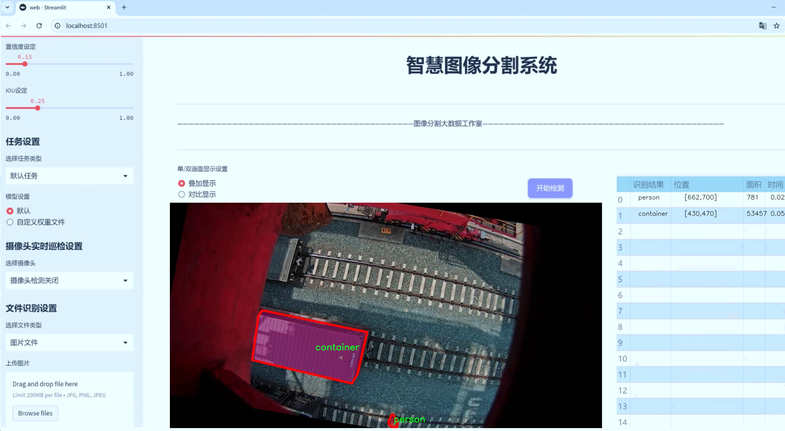
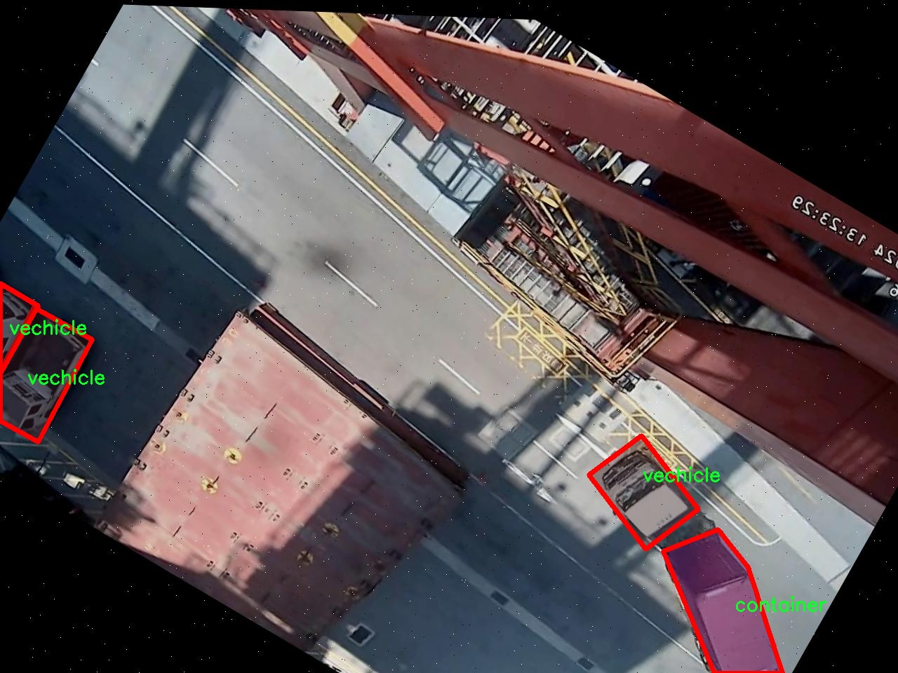
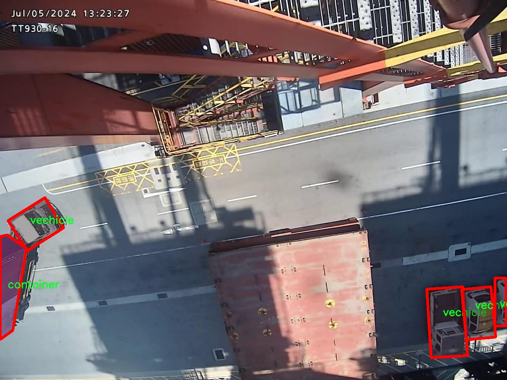
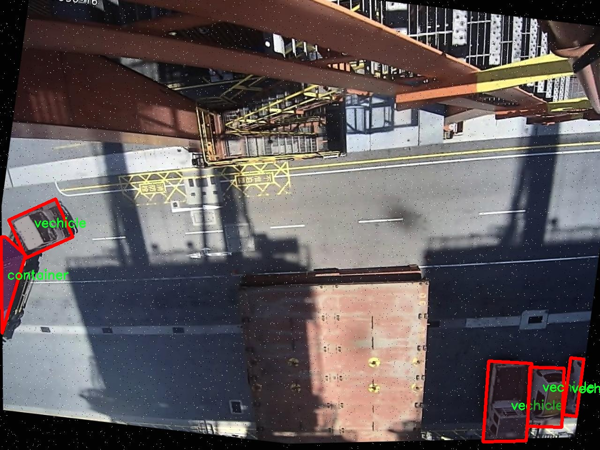
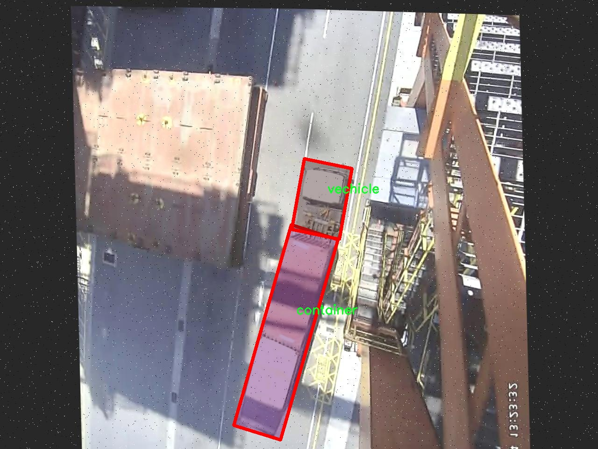
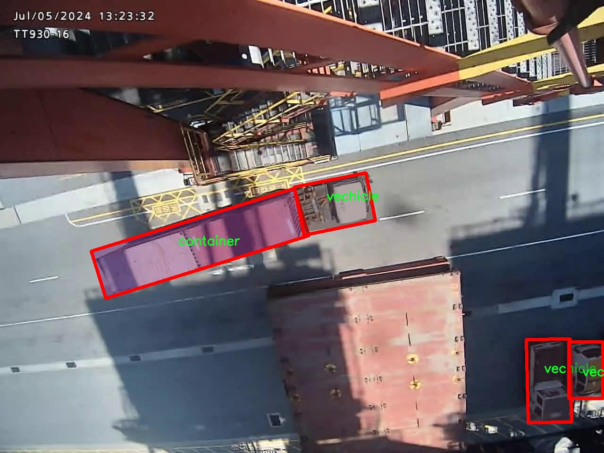

# 俯视视角交通场景图像分割系统： yolov8-seg-FocalModulation

### 1.研究背景与意义

[参考博客](https://gitee.com/YOLOv8_YOLOv11_Segmentation_Studio/projects)

[博客来源](https://kdocs.cn/l/cszuIiCKVNis)

研究背景与意义

随着城市化进程的加快，交通管理面临着日益严峻的挑战。交通事故频发、交通拥堵加剧以及环境污染等问题，促使各国政府和研究机构不断探索智能交通系统的解决方案。在这一背景下，计算机视觉技术的迅猛发展为交通场景的分析与处理提供了新的机遇。尤其是图像分割技术，能够有效地将交通场景中的不同对象进行识别与分离，从而为后续的交通流量分析、事故预警和智能调度提供重要的数据支持。

YOLO（You Only Look Once）系列模型因其高效的实时检测能力而受到广泛关注。YOLOv8作为该系列的最新版本，进一步提升了检测精度和速度，尤其在复杂场景下的表现尤为突出。然而，传统的YOLO模型在处理俯视视角的交通场景时，仍然面临一些挑战，如物体重叠、尺度变化以及光照条件的影响等。因此，基于改进YOLOv8的俯视视角交通场景图像分割系统的研究显得尤为重要。

本研究将利用SEG_HIT数据集，该数据集包含1700幅图像，涵盖了四个主要类别：集装箱、行人、货车托盘和车辆。这些类别的选择不仅反映了现代交通场景的多样性，也为研究提供了丰富的实例。通过对这些图像进行实例分割，可以实现对不同交通对象的精确识别与定位，从而为交通管理和智能调度提供数据支持。

在技术层面，本研究将针对YOLOv8进行改进，结合深度学习中的最新技术，如注意力机制和特征金字塔网络，提升模型在俯视视角下的分割精度。同时，通过数据增强技术，扩展训练数据集的多样性，以提高模型的泛化能力。这一系列改进将使得模型在实际应用中更具鲁棒性，能够适应不同的环境变化。

从社会意义上看，基于改进YOLOv8的俯视视角交通场景图像分割系统的研究，将为智能交通系统的建设提供重要的技术支持。通过对交通场景的实时监测与分析，可以有效降低交通事故发生率，提高交通管理的效率。此外，该系统还可以为城市规划提供数据依据，帮助决策者制定更加科学合理的交通政策，促进可持续发展。

综上所述，基于改进YOLOv8的俯视视角交通场景图像分割系统的研究，不仅具有重要的学术价值，也为实际交通管理提供了切实可行的解决方案。通过深入探讨这一领域，我们期望能够推动智能交通技术的发展，为构建安全、高效、绿色的交通环境贡献力量。

### 2.图片演示







注意：本项目提供完整的训练源码数据集和训练教程,由于此博客编辑较早,暂不提供权重文件（best.pt）,需要按照6.训练教程进行训练后实现上图效果。

### 3.视频演示

[3.1 视频演示](https://www.bilibili.com/video/BV1aFzmYdEgW/)

### 4.数据集信息

##### 4.1 数据集类别数＆类别名

nc: 4
names: ['container', 'person', 'truck-pallet', 'vechicle']


##### 4.2 数据集信息简介

数据集信息展示

在现代交通管理和智能监控系统中，图像分割技术的应用日益广泛。为了提高交通场景的识别精度和效率，特别是在俯视视角下的图像处理，研究人员开发了一个名为“SEG_HIT”的数据集。该数据集专门用于训练和改进YOLOv8-seg模型，以实现对交通场景的精准分割和识别。

“SEG_HIT”数据集包含四个主要类别，分别是“container”（集装箱）、“person”（行人）、“truck-pallet”（卡车托盘）和“vehicle”（车辆）。这些类别的选择反映了城市交通环境中的重要元素，能够帮助模型更好地理解和分析复杂的交通场景。在俯视视角下，这些对象的形状、大小和相对位置的变化都对图像分割的准确性提出了挑战，因此数据集的构建尤为重要。

数据集的设计考虑到了多样性和代表性，包含了不同天气条件、时间段和光照环境下的交通场景图像。这种多样性确保了模型在实际应用中的鲁棒性，能够适应不同的环境变化。每个类别的图像都经过精心标注，确保分割边界的准确性和一致性。通过高质量的标注，研究人员能够有效地训练YOLOv8-seg模型，使其在处理俯视视角图像时能够准确识别和分割出各个对象。

在数据集的构建过程中，研究团队还特别关注了数据的平衡性。为了避免模型在训练过程中对某一类别的偏倚，数据集中的每个类别都被合理地分配了样本数量。这样的设计不仅提高了模型的泛化能力，还增强了其在实际应用中的表现。例如，在城市交通繁忙的区域，行人和车辆的数量可能较多，而在港口或物流中心，集装箱和卡车托盘则可能占据更大的比例。通过合理的样本分配，模型能够更好地适应这些变化，从而提高其在不同场景下的分割精度。

此外，数据集还提供了丰富的元数据，包括图像的拍摄位置、时间戳和相关的环境信息。这些元数据为后续的分析和研究提供了宝贵的参考，研究人员可以基于这些信息进行更深入的交通模式分析和行为预测。

总之，“SEG_HIT”数据集的构建为俯视视角交通场景的图像分割提供了一个坚实的基础。通过对不同类别的细致划分和高质量的标注，该数据集不仅提升了YOLOv8-seg模型的训练效果，也为未来的交通监控和管理系统的智能化发展奠定了重要的基础。随着数据集的不断完善和扩展，研究人员期待在交通场景的自动化识别和处理方面取得更大的突破。











### 5.项目依赖环境部署教程（零基础手把手教学）

[5.1 环境部署教程链接（零基础手把手教学）](https://www.bilibili.com/video/BV1jG4Ve4E9t/?vd_source=bc9aec86d164b67a7004b996143742dc)


[5.2 安装Python虚拟环境创建和依赖库安装视频教程链接（零基础手把手教学）](https://www.bilibili.com/video/BV1nA4VeYEze/?vd_source=bc9aec86d164b67a7004b996143742dc)

### 6.手把手YOLOV8-seg训练视频教程（零基础手把手教学）

[6.1 手把手YOLOV8-seg训练视频教程（零基础小白有手就能学会）](https://www.bilibili.com/video/BV1cA4VeYETe/?vd_source=bc9aec86d164b67a7004b996143742dc)


按照上面的训练视频教程链接加载项目提供的数据集，运行train.py即可开始训练



     Epoch   gpu_mem       box       obj       cls    labels  img_size
     1/200     0G   0.01576   0.01955  0.007536        22      1280: 100%|██████████| 849/849 [14:42<00:00,  1.04s/it]
               Class     Images     Labels          P          R     mAP@.5 mAP@.5:.95: 100%|██████████| 213/213 [01:14<00:00,  2.87it/s]
                 all       3395      17314      0.994      0.957      0.0957      0.0843

     Epoch   gpu_mem       box       obj       cls    labels  img_size
     2/200     0G   0.01578   0.01923  0.007006        22      1280: 100%|██████████| 849/849 [14:44<00:00,  1.04s/it]
               Class     Images     Labels          P          R     mAP@.5 mAP@.5:.95: 100%|██████████| 213/213 [01:12<00:00,  2.95it/s]
                 all       3395      17314      0.996      0.956      0.0957      0.0845

     Epoch   gpu_mem       box       obj       cls    labels  img_size
     3/200     0G   0.01561    0.0191  0.006895        27      1280: 100%|██████████| 849/849 [10:56<00:00,  1.29it/s]
               Class     Images     Labels          P          R     mAP@.5 mAP@.5:.95: 100%|███████   | 187/213 [00:52<00:00,  4.04it/s]
                 all       3395      17314      0.996      0.957      0.0957      0.0845


### 7.50+种全套YOLOV8-seg创新点加载调参实验视频教程（一键加载写好的改进模型的配置文件）

[7.1 50+种全套YOLOV8-seg创新点加载调参实验视频教程（一键加载写好的改进模型的配置文件）](https://www.bilibili.com/video/BV1Hw4VePEXv/?vd_source=bc9aec86d164b67a7004b996143742dc)

### YOLOV8-seg算法简介

原始YOLOv8-seg算法原理

YOLOv8-seg算法是YOLO系列目标检测算法的最新进展，基于YOLOv8的框架，结合了分割任务的需求，旨在实现更高效的目标检测与分割。作为一种基于卷积神经网络的深度学习模型，YOLOv8-seg在YOLOv8的基础上进行了进一步的优化和扩展，采用了更为复杂的网络结构和先进的技术手段，以提升目标检测和分割的精度与速度。

YOLOv8-seg的核心原理依然是将整个图像作为输入，通过深度学习模型直接进行目标检测和分割，而不需要传统的滑动窗口或区域提议方法。这种方法不仅提高了检测的速度，还增强了模型对不同场景和目标的适应能力。YOLOv8-seg通过引入多尺度训练和测试、特征金字塔网络（FPN）等技术，进一步提升了对不同尺寸目标的检测性能。

在数据预处理方面，YOLOv8-seg延续了YOLOv5的策略，采用了多种数据增强技术，如马赛克增强、混合增强、空间扰动和颜色扰动等。这些增强手段的引入，使得模型在训练过程中能够接触到更为丰富的样本，从而提高了模型的泛化能力和鲁棒性。通过对输入数据的多样化处理，YOLOv8-seg能够更好地适应复杂的现实场景，提升目标检测和分割的效果。

在网络结构上，YOLOv8-seg继承了YOLOv8的深度卷积神经网络架构，采用了新的C2f模块替代了YOLOv5中的C3模块。C2f模块通过引入更多的分支，丰富了梯度回传时的支流，使得特征提取更加高效。该模块的设计旨在提高特征的表达能力，从而更好地捕捉图像中的重要信息。此外，YOLOv8-seg还保留了FPN-PAN结构，以实现多尺度特征的有效融合，确保模型能够在不同尺度上都能准确地检测和分割目标。

YOLOv8-seg的检测头采用了解耦头结构，这一结构的引入使得分类和定位任务能够独立进行。具体而言，YOLOv8-seg的检测头由两条并行的分支组成，分别负责提取类别特征和位置特征。这种解耦设计不仅提高了模型的灵活性，还使得模型在处理复杂场景时能够更为精准地进行目标检测与分割。

在标签分配策略方面，YOLOv8-seg采用了TOOD策略，这是一种动态标签分配方法。与传统的静态标签分配方法不同，TOOD策略能够根据当前的训练状态动态调整标签的分配，从而提高正负样本的匹配效率。这一策略的引入，旨在解决传统方法中由于数据集不充分而导致的候选框聚类不准确的问题。YOLOv8-seg通过对目标分数和类别得分的有效利用，优化了损失函数的设计，使得模型在训练过程中能够更好地关注高质量的样本，从而提升整体的检测性能。

在损失函数的设计上，YOLOv8-seg引入了Varifocal Loss（VFL）和CIoU Loss与DFL Loss的组合形式。VFL通过对正负样本进行加权处理，使得模型在训练时能够更加关注高质量的正样本，同时降低负样本对损失的影响。这种不对称的损失设计，使得模型在面对复杂场景时，能够更有效地进行目标检测与分割，提升了整体的检测精度。

YOLOv8-seg的网络结构分为三个主要部分：Backbone、Neck和Head。Backbone部分采用了一系列卷积和反卷积层，通过残差连接和瓶颈结构来提取特征。Neck部分则负责多尺度特征的融合，以捕捉不同尺度目标的信息，提升目标检测的性能和鲁棒性。最后，Head部分则负责最终的目标检测和分类任务，通过设有多个检测头的设计，确保在不同尺寸信息下都能准确地检测目标。

综上所述，YOLOv8-seg算法在YOLOv8的基础上，通过引入新的网络结构、优化的数据处理方式和动态标签分配策略，极大地提升了目标检测与分割的性能。其在各类应用场景中的广泛适用性，使得YOLOv8-seg成为当前目标检测与分割领域中的重要工具，能够有效满足智能监控、自动驾驶、人脸识别等多种应用需求。通过不断的优化与改进，YOLOv8-seg无疑将在未来的研究与应用中发挥更为重要的作用。


### 9.系统功能展示（检测对象为举例，实际内容以本项目数据集为准）

图9.1.系统支持检测结果表格显示

  图9.2.系统支持置信度和IOU阈值手动调节

  图9.3.系统支持自定义加载权重文件best.pt(需要你通过步骤5中训练获得)

  图9.4.系统支持摄像头实时识别

  图9.5.系统支持图片识别

  图9.6.系统支持视频识别

  图9.7.系统支持识别结果文件自动保存

  图9.8.系统支持Excel导出检测结果数据


### 10.50+种全套YOLOV8-seg创新点原理讲解（非科班也可以轻松写刊发刊，V11版本正在科研待更新）

#### 10.1 由于篇幅限制，每个创新点的具体原理讲解就不一一展开，具体见下列网址中的创新点对应子项目的技术原理博客网址【Blog】：


[10.1 50+种全套YOLOV8-seg创新点原理讲解链接](https://gitee.com/qunmasj/good)

#### 10.2 部分改进模块原理讲解(完整的改进原理见上图和技术博客链接)【如果此小节的图加载失败可以通过CSDN或者Github搜索该博客的标题访问原始博客，原始博客图片显示正常】

### Gold-YOLO简介
YOLO再升级：华为诺亚提出Gold-YOLO，聚集-分发机制打造新SOTA
在过去的几年中，YOLO系列模型已经成为实时目标检测领域的领先方法。许多研究通过修改架构、增加数据和设计新的损失函数，将基线推向了更高的水平。然而以前的模型仍然存在信息融合问题，尽管特征金字塔网络（FPN）和路径聚合网络（PANet）已经在一定程度上缓解了这个问题。因此，本研究提出了一种先进的聚集和分发机制（GD机制），该机制通过卷积和自注意力操作实现。这种新设计的模型被称为Gold-YOLO，它提升了多尺度特征融合能力，在所有模型尺度上实现了延迟和准确性的理想平衡。此外，本文首次在YOLO系列中实现了MAE风格的预训练，使得YOLO系列模型能够从无监督预训练中受益。Gold-YOLO-N在COCO val2017数据集上实现了出色的39.9% AP，并在T4 GPU上实现了1030 FPS，超过了之前的SOTA模型YOLOv6-3.0-N，其FPS相似，但性能提升了2.4%。


#### Gold-YOLO


YOLO系列的中间层结构采用了传统的FPN结构，其中包含多个分支用于多尺度特征融合。然而，它只充分融合来自相邻级别的特征，对于其他层次的信息只能间接地进行“递归”获取。

传统的FPN结构在信息传输过程中存在丢失大量信息的问题。这是因为层之间的信息交互仅限于中间层选择的信息，未被选择的信息在传输过程中被丢弃。这种情况导致某个Level的信息只能充分辅助相邻层，而对其他全局层的帮助较弱。因此，整体上信息融合的有效性可能受到限制。
为了避免在传输过程中丢失信息，本文采用了一种新颖的“聚集和分发”机制（GD），放弃了原始的递归方法。该机制使用一个统一的模块来收集和融合所有Level的信息，并将其分发到不同的Level。通过这种方式，作者不仅避免了传统FPN结构固有的信息丢失问题，还增强了中间层的部分信息融合能力，而且并没有显著增加延迟。


# 8.低阶聚合和分发分支 Low-stage gather-and-distribute branch
从主干网络中选择输出的B2、B3、B4、B5特征进行融合，以获取保留小目标信息的高分辨率特征。


低阶特征对齐模块 (Low-stage feature alignment module)： 在低阶特征对齐模块（Low-FAM）中，采用平均池化（AvgPool）操作对输入特征进行下采样，以实现统一的大小。通过将特征调整为组中最小的特征大小（ R B 4 = 1 / 4 R ） （R_{B4} = 1/4R）（R 
B4 =1/4R），我们得到对齐后的特征F a l i g n F_{align}F align 。低阶特征对齐技术确保了信息的高效聚合，同时通过变换器模块来最小化后续处理的计算复杂性。其中选择 R B 4 R_{B4}R B4 作为特征对齐的目标大小主要基于保留更多的低层信息的同时不会带来较大的计算延迟。
低阶信息融合模块(Low-stage information fusion module)： 低阶信息融合模块（Low-IFM）设计包括多层重新参数化卷积块（RepBlock）和分裂操作。具体而言，RepBlock以F a l i g n ( c h a n n e l = s u m ( C B 2 ， C B 3 ， C B 4 ， C B 5 ) ) F_{align} (channel= sum(C_{B2}，C_{B3}，C_{B4}，C_{B5}))F align (channel=sum(C B2 ，C B3 ，C B4 ，C B5 )作为输入，并生成F f u s e ( c h a n n e l = C B 4 + C B 5 ) F_{fuse} (channel= C_{B4} + C_{B5})F fuse (channel=C B4 +C B5 )。其中中间通道是一个可调整的值（例如256），以适应不同的模型大小。由RepBlock生成的特征随后在通道维度上分裂为F i n j P 3 Finj_P3Finj P 3和F i n j P 4 Finj_P4Finj P 4，然后与不同级别的特征进行融合。


# 8.高阶聚合和分发分支 High-stage gather-and-distribute branch
高级全局特征对齐模块（High-GD）将由低级全局特征对齐模块（Low-GD）生成的特征{P3, P4, P5}进行融合。


高级特征对齐模块(High-stage feature alignment module)： High-FAM由avgpool组成，用于将输入特征的维度减小到统一的尺寸。具体而言，当输入特征的尺寸为{R P 3 R_{P3}R P3 , R P 4 R_{P4}R P4 , R P 5 R_{P 5}R P5 }时，avgpool将特征尺寸减小到该特征组中最小的尺寸（R P 5 R_{P5}R P5  = 1/8R）。由于transformer模块提取了高层次的信息，池化操作有助于信息聚合，同时降低了transformer模块后续步骤的计算需求。

Transformer融合模块由多个堆叠的transformer组成，transformer块的数量为L。每个transformer块包括一个多头注意力块、一个前馈网络（FFN）和残差连接。采用与LeViT相同的设置来配置多头注意力块，使用16个通道作为键K和查询Q的头维度，32个通道作为值V的头维度。为了加速推理过程，将层归一化操作替换为批归一化，并将所有的GELU激活函数替换为ReLU。为了增强变换器块的局部连接，在两个1x1卷积层之间添加了一个深度卷积层。同时，将FFN的扩展因子设置为2，以在速度和计算成本之间取得平衡。

信息注入模块(Information injection module)： 高级全局特征对齐模块（High-GD）中的信息注入模块与低级全局特征对齐模块（Low-GD）中的相同。在高级阶段，局部特征（Flocal）等于Pi，因此公式如下所示：


### 增强的跨层信息流动 Enhanced cross-layer information flow
为了进一步提升性能，从YOLOv8 中的PAFPN模块中得到启发，引入了Inject-LAF模块。该模块是注入模块的增强版，包括了一个轻量级相邻层融合（LAF）模块，该模块被添加到注入模块的输入位置。为了在速度和准确性之间取得平衡，设计了两个LAF模型：LAF低级模型和LAF高级模型，分别用于低级注入（合并相邻两层的特征）和高级注入（合并相邻一层的特征）。它们的结构如图5(b)所示。为了确保来自不同层级的特征图与目标大小对齐，在实现中的两个LAF模型仅使用了三个操作符：双线性插值（上采样过小的特征）、平均池化（下采样过大的特征）和1x1卷积（调整与目标通道不同的特征）。模型中的LAF模块与信息注入模块的结合有效地平衡了准确性和速度之间的关系。通过使用简化的操作，能够增加不同层级之间的信息流路径数量，从而提高性能而不显著增加延迟。


### 11.项目核心源码讲解（再也不用担心看不懂代码逻辑）

#### 11.1 ultralytics\models\nas\model.py

以下是对给定代码的核心部分进行分析和注释的结果：

```python
# Ultralytics YOLO 🚀, AGPL-3.0 license
"""
YOLO-NAS模型接口。

示例：
    ```python
    from ultralytics import NAS

    model = NAS('yolo_nas_s')
    results = model.predict('ultralytics/assets/bus.jpg')
    ```
"""

from pathlib import Path  # 导入Path类用于处理文件路径
import torch  # 导入PyTorch库

from ultralytics.engine.model import Model  # 从Ultralytics引擎导入基础Model类
from ultralytics.utils.torch_utils import model_info, smart_inference_mode  # 导入模型信息和智能推理模式工具

from .predict import NASPredictor  # 导入NAS预测器
from .val import NASValidator  # 导入NAS验证器


class NAS(Model):
    """
    YOLO NAS模型用于目标检测。

    该类提供YOLO-NAS模型的接口，并扩展了Ultralytics引擎中的Model类。
    旨在使用预训练或自定义训练的YOLO-NAS模型来简化目标检测任务。

    属性：
        model (str): 预训练模型的路径或模型名称。默认为'yolo_nas_s.pt'。

    注意：
        YOLO-NAS模型仅支持预训练模型。请勿提供YAML配置文件。
    """

    def __init__(self, model='yolo_nas_s.pt') -> None:
        """使用提供的或默认的'yolo_nas_s.pt'模型初始化NAS模型。"""
        # 确保模型文件不是YAML格式
        assert Path(model).suffix not in ('.yaml', '.yml'), 'YOLO-NAS模型仅支持预训练模型。'
        super().__init__(model, task='detect')  # 调用父类构造函数

    @smart_inference_mode()  # 使用智能推理模式装饰器
    def _load(self, weights: str, task: str):
        """加载现有的NAS模型权重，或在未提供权重时创建新的NAS模型。"""
        import super_gradients  # 导入super_gradients库
        suffix = Path(weights).suffix  # 获取权重文件的后缀
        if suffix == '.pt':  # 如果是PyTorch模型文件
            self.model = torch.load(weights)  # 加载模型权重
        elif suffix == '':  # 如果没有后缀
            self.model = super_gradients.training.models.get(weights, pretrained_weights='coco')  # 获取预训练模型
        
        # 标准化模型属性
        self.model.fuse = lambda verbose=True: self.model  # 定义融合方法
        self.model.stride = torch.tensor([32])  # 设置步幅
        self.model.names = dict(enumerate(self.model._class_names))  # 设置类别名称
        self.model.is_fused = lambda: False  # 定义是否融合的方法
        self.model.yaml = {}  # 设置YAML配置为空
        self.model.pt_path = weights  # 设置权重文件路径
        self.model.task = 'detect'  # 设置任务类型为检测

    def info(self, detailed=False, verbose=True):
        """
        记录模型信息。

        参数：
            detailed (bool): 是否显示模型的详细信息。
            verbose (bool): 控制输出的详细程度。
        """
        return model_info(self.model, detailed=detailed, verbose=verbose, imgsz=640)  # 返回模型信息

    @property
    def task_map(self):
        """返回任务与相应预测器和验证器类的映射字典。"""
        return {'detect': {'predictor': NASPredictor, 'validator': NASValidator}}  # 映射检测任务
```

### 核心部分分析：
1. **类定义**：`NAS`类继承自`Model`类，提供YOLO-NAS模型的接口。
2. **初始化方法**：`__init__`方法确保模型文件是预训练模型，并调用父类构造函数。
3. **加载模型**：`_load`方法负责加载模型权重，并标准化模型属性。
4. **模型信息**：`info`方法用于记录和返回模型的信息。
5. **任务映射**：`task_map`属性返回与任务相关的预测器和验证器的映射。

这些部分是实现YOLO-NAS模型功能的核心，其他辅助功能和详细实现可以根据需要进行扩展。

这个文件是Ultralytics YOLO（You Only Look Once）模型的一部分，具体实现了YOLO-NAS（Neural Architecture Search）模型的接口。YOLO-NAS是一种用于目标检测的深度学习模型，旨在提供高效的对象检测能力。

在文件开头，有一个模块说明和使用示例，展示了如何导入NAS类并使用它来加载模型和进行预测。示例代码展示了如何实例化一个YOLO-NAS模型，并使用该模型对一张图片进行预测。

接下来，文件导入了一些必要的库，包括`Path`（用于处理文件路径）、`torch`（PyTorch库，用于深度学习）、以及Ultralytics引擎中的`Model`类和一些工具函数。还导入了用于预测和验证的类`NASPredictor`和`NASValidator`。

`NAS`类继承自`Model`类，提供了YOLO-NAS模型的接口。类的构造函数`__init__`接受一个模型路径参数，默认值为'yolo_nas_s.pt'。在构造函数中，使用assert语句确保传入的模型路径不以`.yaml`或`.yml`结尾，因为YOLO-NAS模型只支持预训练模型，而不支持YAML配置文件。

`_load`方法用于加载模型权重。如果提供的权重文件是`.pt`格式，则直接使用`torch.load`加载模型；如果没有后缀，则通过`super_gradients`库获取预训练模型。此方法还对模型进行了一些标准化处理，包括设置模型的融合方法、步幅、类别名称等。

`info`方法用于记录模型的信息，可以选择是否显示详细信息和控制输出的详细程度。它调用了`model_info`函数来获取模型的相关信息。

最后，`task_map`属性返回一个字典，映射任务到相应的预测器和验证器类，这里只支持目标检测任务，分别对应`NASPredictor`和`NASValidator`类。

总体而言，这个文件提供了YOLO-NAS模型的基本框架和接口，方便用户加载预训练模型并进行目标检测任务。

#### 11.2 ultralytics\nn\backbone\VanillaNet.py

以下是经过简化并添加详细中文注释的核心代码部分：

```python
import torch
import torch.nn as nn
import torch.nn.functional as F
from timm.layers import weight_init

# 定义激活函数类
class Activation(nn.ReLU):
    def __init__(self, dim, act_num=3, deploy=False):
        super(Activation, self).__init__()
        self.deploy = deploy  # 是否为部署模式
        # 初始化权重和偏置
        self.weight = torch.nn.Parameter(torch.randn(dim, 1, act_num * 2 + 1, act_num * 2 + 1))
        self.bias = None
        self.bn = nn.BatchNorm2d(dim, eps=1e-6)  # 批归一化
        self.dim = dim
        self.act_num = act_num
        weight_init.trunc_normal_(self.weight, std=.02)  # 权重初始化

    def forward(self, x):
        # 前向传播
        if self.deploy:
            return F.conv2d(
                super(Activation, self).forward(x), 
                self.weight, self.bias, padding=(self.act_num * 2 + 1) // 2, groups=self.dim)
        else:
            return self.bn(F.conv2d(
                super(Activation, self).forward(x),
                self.weight, padding=self.act_num, groups=self.dim))

    def switch_to_deploy(self):
        # 切换到部署模式
        if not self.deploy:
            kernel, bias = self._fuse_bn_tensor(self.weight, self.bn)
            self.weight.data = kernel
            self.bias = torch.nn.Parameter(torch.zeros(self.dim))
            self.bias.data = bias
            self.__delattr__('bn')  # 删除bn属性
            self.deploy = True

    def _fuse_bn_tensor(self, weight, bn):
        # 融合卷积层和批归一化层的权重和偏置
        kernel = weight
        running_mean = bn.running_mean
        running_var = bn.running_var
        gamma = bn.weight
        beta = bn.bias
        eps = bn.eps
        std = (running_var + eps).sqrt()
        t = (gamma / std).reshape(-1, 1, 1, 1)
        return kernel * t, beta + (0 - running_mean) * gamma / std

# 定义网络块
class Block(nn.Module):
    def __init__(self, dim, dim_out, act_num=3, stride=2, deploy=False):
        super().__init__()
        self.deploy = deploy
        # 根据是否部署选择不同的卷积层
        if self.deploy:
            self.conv = nn.Conv2d(dim, dim_out, kernel_size=1)
        else:
            self.conv1 = nn.Sequential(
                nn.Conv2d(dim, dim, kernel_size=1),
                nn.BatchNorm2d(dim, eps=1e-6),
            )
            self.conv2 = nn.Sequential(
                nn.Conv2d(dim, dim_out, kernel_size=1),
                nn.BatchNorm2d(dim_out, eps=1e-6)
            )
        # 池化层
        self.pool = nn.MaxPool2d(stride) if stride != 1 else nn.Identity()
        self.act = Activation(dim_out, act_num)  # 激活函数

    def forward(self, x):
        # 前向传播
        if self.deploy:
            x = self.conv(x)
        else:
            x = self.conv1(x)
            x = F.leaky_relu(x, negative_slope=1)  # 使用Leaky ReLU激活
            x = self.conv2(x)

        x = self.pool(x)  # 池化
        x = self.act(x)  # 激活
        return x

# 定义主网络结构
class VanillaNet(nn.Module):
    def __init__(self, in_chans=3, num_classes=1000, dims=[96, 192, 384, 768], 
                 drop_rate=0, act_num=3, strides=[2, 2, 2, 1], deploy=False):
        super().__init__()
        self.deploy = deploy
        # 网络的初始部分
        if self.deploy:
            self.stem = nn.Sequential(
                nn.Conv2d(in_chans, dims[0], kernel_size=4, stride=4),
                Activation(dims[0], act_num)
            )
        else:
            self.stem1 = nn.Sequential(
                nn.Conv2d(in_chans, dims[0], kernel_size=4, stride=4),
                nn.BatchNorm2d(dims[0], eps=1e-6),
            )
            self.stem2 = nn.Sequential(
                nn.Conv2d(dims[0], dims[0], kernel_size=1, stride=1),
                nn.BatchNorm2d(dims[0], eps=1e-6),
                Activation(dims[0], act_num)
            )

        self.stages = nn.ModuleList()
        for i in range(len(strides)):
            stage = Block(dim=dims[i], dim_out=dims[i + 1], act_num=act_num, stride=strides[i], deploy=deploy)
            self.stages.append(stage)  # 添加网络块

    def forward(self, x):
        # 前向传播
        if self.deploy:
            x = self.stem(x)
        else:
            x = self.stem1(x)
            x = F.leaky_relu(x, negative_slope=1)
            x = self.stem2(x)

        for stage in self.stages:
            x = stage(x)  # 通过每个网络块
        return x

# 测试网络
if __name__ == '__main__':
    inputs = torch.randn((1, 3, 640, 640))  # 随机输入
    model = VanillaNet()  # 创建模型
    pred = model(inputs)  # 前向传播
    print(pred.size())  # 输出预测结果的尺寸
```

### 代码说明：
1. **Activation 类**：自定义的激活函数类，继承自 `nn.ReLU`，支持批归一化和权重初始化。
2. **Block 类**：网络的基本构建块，包含卷积层、批归一化、激活函数和池化层。
3. **VanillaNet 类**：主网络结构，包含初始层和多个 Block 组成的阶段。
4. **前向传播**：通过输入数据逐层传递，最终输出特征图。
5. **测试部分**：创建一个随机输入并通过模型进行前向传播，输出结果的尺寸。

这个程序文件定义了一个名为 `VanillaNet` 的深度学习模型，主要用于图像处理任务。文件开头包含版权信息和许可条款，表明该程序是自由软件，遵循 MIT 许可证。

程序首先导入了必要的库，包括 PyTorch 和一些自定义的层。接着，定义了一个名为 `activation` 的类，该类继承自 `nn.ReLU`，用于实现带有可学习权重的激活函数。这个类的构造函数中初始化了权重和偏置，并包含了批量归一化的操作。`forward` 方法根据是否处于部署模式选择不同的计算路径。

接下来定义了一个 `Block` 类，表示网络中的一个基本模块。该模块可以包含多个卷积层和激活函数，支持可选的自适应池化。`Block` 类中同样实现了权重融合的方法，以便在模型部署时优化性能。

`VanillaNet` 类是整个网络的主体。它的构造函数接收输入通道数、类别数、各层的维度、丢弃率、激活函数数量、步幅等参数，并构建网络的各个阶段。网络的前向传播方法 `forward` 会根据输入的大小计算特征图，并在每个阶段保存特征图以供后续使用。

在模型中，还定义了一些辅助函数，例如 `_init_weights` 用于初始化权重，`change_act` 用于改变激活函数的学习率，以及 `switch_to_deploy` 用于切换到部署模式，优化模型的推理速度。

此外，文件中还定义了一些函数（如 `vanillanet_5` 到 `vanillanet_13`），用于创建不同配置的 `VanillaNet` 模型，并支持加载预训练权重。

最后，文件的主程序部分创建了一个随机输入，并实例化了一个 `vanillanet_10` 模型，进行前向传播并打印输出特征图的尺寸。这部分代码可以用于测试模型的构建和运行情况。

#### 11.3 ultralytics\utils\triton.py

以下是代码中最核心的部分，并附上详细的中文注释：

```python
from typing import List
from urllib.parse import urlsplit
import numpy as np

class TritonRemoteModel:
    """
    与远程Triton推理服务器模型交互的客户端。

    属性:
        endpoint (str): Triton服务器上模型的名称。
        url (str): Triton服务器的URL。
        triton_client: Triton客户端（HTTP或gRPC）。
        InferInput: Triton客户端的输入类。
        InferRequestedOutput: Triton客户端的输出请求类。
        input_formats (List[str]): 模型输入的数据类型。
        np_input_formats (List[type]): 模型输入的numpy数据类型。
        input_names (List[str]): 模型输入的名称。
        output_names (List[str]): 模型输出的名称。
    """

    def __init__(self, url: str, endpoint: str = '', scheme: str = ''):
        """
        初始化TritonRemoteModel。

        参数可以单独提供，也可以从形式为<scheme>://<netloc>/<endpoint>/<task_name>的'url'参数中解析。

        参数:
            url (str): Triton服务器的URL。
            endpoint (str): Triton服务器上模型的名称。
            scheme (str): 通信方案（'http'或'gRPC'）。
        """
        if not endpoint and not scheme:  # 从URL字符串解析所有参数
            splits = urlsplit(url)
            endpoint = splits.path.strip('/').split('/')[0]  # 获取模型名称
            scheme = splits.scheme  # 获取通信方案
            url = splits.netloc  # 获取服务器地址

        self.endpoint = endpoint  # 设置模型名称
        self.url = url  # 设置服务器URL

        # 根据通信方案选择Triton客户端
        if scheme == 'http':
            import tritonclient.http as client  # 导入HTTP客户端
            self.triton_client = client.InferenceServerClient(url=self.url, verbose=False, ssl=False)
            config = self.triton_client.get_model_config(endpoint)  # 获取模型配置
        else:
            import tritonclient.grpc as client  # 导入gRPC客户端
            self.triton_client = client.InferenceServerClient(url=self.url, verbose=False, ssl=False)
            config = self.triton_client.get_model_config(endpoint, as_json=True)['config']  # 获取模型配置

        # 按字母顺序排序输出名称，例如 'output0', 'output1' 等
        config['output'] = sorted(config['output'], key=lambda x: x.get('name'))

        # 定义模型属性
        type_map = {'TYPE_FP32': np.float32, 'TYPE_FP16': np.float16, 'TYPE_UINT8': np.uint8}  # 数据类型映射
        self.InferRequestedOutput = client.InferRequestedOutput  # 设置输出请求类
        self.InferInput = client.InferInput  # 设置输入类
        self.input_formats = [x['data_type'] for x in config['input']]  # 获取输入数据类型
        self.np_input_formats = [type_map[x] for x in self.input_formats]  # 获取numpy数据类型
        self.input_names = [x['name'] for x in config['input']]  # 获取输入名称
        self.output_names = [x['name'] for x in config['output']]  # 获取输出名称

    def __call__(self, *inputs: np.ndarray) -> List[np.ndarray]:
        """
        使用给定的输入调用模型。

        参数:
            *inputs (List[np.ndarray]): 模型的输入数据。

        返回:
            List[np.ndarray]: 模型输出。
        """
        infer_inputs = []  # 存储输入数据的列表
        input_format = inputs[0].dtype  # 获取输入数据的格式
        for i, x in enumerate(inputs):
            # 如果输入数据类型与模型要求不一致，则进行类型转换
            if x.dtype != self.np_input_formats[i]:
                x = x.astype(self.np_input_formats[i])
            # 创建InferInput对象并设置数据
            infer_input = self.InferInput(self.input_names[i], [*x.shape], self.input_formats[i].replace('TYPE_', ''))
            infer_input.set_data_from_numpy(x)  # 从numpy数组设置数据
            infer_inputs.append(infer_input)  # 添加到输入列表

        # 创建输出请求对象
        infer_outputs = [self.InferRequestedOutput(output_name) for output_name in self.output_names]
        # 调用Triton客户端进行推理
        outputs = self.triton_client.infer(model_name=self.endpoint, inputs=infer_inputs, outputs=infer_outputs)

        # 返回输出结果，转换为原始输入格式
        return [outputs.as_numpy(output_name).astype(input_format) for output_name in self.output_names]
```

### 代码说明：
1. **类定义**：`TritonRemoteModel`类用于与Triton推理服务器的模型进行交互。
2. **初始化方法**：`__init__`方法用于设置模型的URL、名称和通信方案，并获取模型的输入输出配置。
3. **调用方法**：`__call__`方法允许用户通过传入numpy数组来调用模型，进行推理并返回结果。该方法处理输入数据的类型转换，并构建输入和输出请求。

这个程序文件定义了一个名为 `TritonRemoteModel` 的类，用于与远程的 Triton 推理服务器模型进行交互。该类的主要功能是通过指定的 URL 和模型名称，初始化与 Triton 服务器的连接，并提供调用模型进行推理的接口。

在类的构造函数 `__init__` 中，首先解析输入的 URL，提取出模型的端点和通信协议（HTTP 或 gRPC）。如果没有提供端点和协议，程序会从 URL 中解析这些信息。接着，根据指定的通信协议选择相应的 Triton 客户端，并获取模型的配置。模型的输出名称会按字母顺序排序，以便后续处理。

类中定义了一些属性，包括模型的输入输出名称、数据类型等。输入格式和对应的 NumPy 数据类型被存储在 `input_formats` 和 `np_input_formats` 中，方便后续的数据处理。

类的 `__call__` 方法允许用户以函数的方式调用模型。用户可以传入一个或多个 NumPy 数组作为输入数据。该方法会检查输入数据的类型是否与模型要求的类型一致，如果不一致，则会进行类型转换。然后，创建输入对象并将数据设置到 Triton 客户端中，最后发起推理请求。

推理的输出结果会被转换为 NumPy 数组并返回，用户可以通过输出名称获取相应的结果。整体来看，这个类提供了一个简洁的接口，使得用户能够方便地与 Triton 推理服务器进行交互，进行模型推理。

#### 11.4 demo_test_video.py

以下是代码中最核心的部分，并附上详细的中文注释：

```python
import cv2
import numpy as np
from PIL import ImageFont, ImageDraw, Image
from hashlib import md5
from model import Web_Detector
from chinese_name_list import Label_list

def generate_color_based_on_name(name):
    # 使用哈希函数生成稳定的颜色
    hash_object = md5(name.encode())  # 对名字进行MD5哈希
    hex_color = hash_object.hexdigest()[:6]  # 取前6位16进制数作为颜色
    r, g, b = int(hex_color[0:2], 16), int(hex_color[2:4], 16), int(hex_color[4:6], 16)  # 转换为RGB
    return (b, g, r)  # OpenCV 使用BGR格式

def draw_with_chinese(image, text, position, font_size=20, color=(255, 0, 0)):
    # 在图像上绘制中文文本
    image_pil = Image.fromarray(cv2.cvtColor(image, cv2.COLOR_BGR2RGB))  # 转换为PIL格式
    draw = ImageDraw.Draw(image_pil)  # 创建绘图对象
    font = ImageFont.truetype("simsun.ttc", font_size, encoding="unic")  # 加载中文字体
    draw.text(position, text, font=font, fill=color)  # 绘制文本
    return cv2.cvtColor(np.array(image_pil), cv2.COLOR_RGB2BGR)  # 转换回OpenCV格式

def draw_detections(image, info):
    # 绘制检测结果，包括边框、类别名称等
    name, bbox = info['class_name'], info['bbox']  # 获取类别名称和边界框
    x1, y1, x2, y2 = bbox  # 解包边界框坐标
    cv2.rectangle(image, (x1, y1), (x2, y2), color=(0, 0, 255), thickness=3)  # 绘制边界框
    image = draw_with_chinese(image, name, (x1, y1 - 10), font_size=20)  # 绘制类别名称
    return image

def process_frame(model, image):
    # 处理每一帧图像
    pre_img = model.preprocess(image)  # 预处理图像
    pred = model.predict(pre_img)  # 进行预测
    det = pred[0]  # 获取检测结果

    if det is not None and len(det):
        det_info = model.postprocess(pred)  # 后处理，获取检测信息
        for info in det_info:
            image = draw_detections(image, info)  # 绘制检测结果
    return image

if __name__ == "__main__":
    model = Web_Detector()  # 初始化检测模型
    model.load_model("./weights/yolov8s-seg.pt")  # 加载模型权重

    # 视频处理
    video_path = ''  # 输入视频路径
    cap = cv2.VideoCapture(video_path)  # 打开视频文件
    while cap.isOpened():
        ret, frame = cap.read()  # 逐帧读取视频
        if not ret:
            break  # 如果没有读取到帧，退出循环
        processed_frame = process_frame(model, frame)  # 处理当前帧
        cv2.imshow('Processed Video', processed_frame)  # 显示处理后的帧
        if cv2.waitKey(1) & 0xFF == ord('q'):
            break  # 按'q'键退出
    cap.release()  # 释放视频捕获对象
    cv2.destroyAllWindows()  # 关闭所有OpenCV窗口
```

### 代码说明：
1. **生成颜色**：`generate_color_based_on_name` 函数使用MD5哈希生成一个稳定的颜色值，以便根据不同的名字生成不同的颜色。
2. **绘制中文文本**：`draw_with_chinese` 函数将中文文本绘制到图像上，使用PIL库处理中文字体。
3. **绘制检测结果**：`draw_detections` 函数负责在图像上绘制检测到的物体的边界框和类别名称。
4. **处理每一帧**：`process_frame` 函数对每一帧图像进行预处理、预测和后处理，并绘制检测结果。
5. **主程序**：在主程序中，初始化模型并加载权重，逐帧读取视频并处理，最后显示处理后的结果。

这个程序文件 `demo_test_video.py` 是一个用于处理视频的图像检测和标注的脚本。它利用了计算机视觉库 OpenCV 和深度学习模型进行目标检测和分割，并在视频帧上绘制检测结果。

首先，程序导入了一些必要的库，包括随机数生成、OpenCV、NumPy、PIL（用于处理图像字体和绘制文本）、哈希库（用于生成颜色）以及自定义的模型和标签列表。接着，定义了几个辅助函数。

`generate_color_based_on_name` 函数使用 MD5 哈希算法根据给定的名称生成一种稳定的颜色。这个颜色是通过将名称编码为字节，然后计算其哈希值并提取前六位十六进制数来实现的，最终转换为 BGR 格式以适应 OpenCV 的要求。

`calculate_polygon_area` 函数用于计算给定点集的多边形面积，使用 OpenCV 的 `contourArea` 方法。

`draw_with_chinese` 函数负责在图像上绘制中文文本。它首先将 OpenCV 图像转换为 PIL 图像，然后使用指定的字体和颜色在给定位置绘制文本，最后再将图像转换回 OpenCV 格式。

`adjust_parameter` 函数根据图像的大小调整参数，以便在不同大小的图像上保持一致的绘制效果。

`draw_detections` 函数是核心部分，它根据检测到的信息在图像上绘制边界框、掩码和相关的文本信息。该函数首先根据图像的大小调整绘制参数，然后根据是否存在掩码（mask）来选择绘制方式。如果没有掩码，则绘制矩形框和类别名称；如果有掩码，则绘制多边形并计算其面积、周长和圆度，同时随机选择一些点来计算颜色值。最后，将这些信息绘制到图像上。

`process_frame` 函数负责处理每一帧图像。它首先对图像进行预处理，然后使用模型进行预测，最后将检测到的结果传递给 `draw_detections` 函数进行绘制。

在主程序部分，首先加载模型和标签列表，然后打开视频文件进行逐帧处理。在循环中，读取每一帧并调用 `process_frame` 进行处理，最后显示处理后的图像。如果按下 'q' 键，则退出循环。

总体而言，这个程序实现了一个完整的视频目标检测和标注的流程，能够实时处理视频并在每一帧上绘制检测结果。

#### 11.5 ultralytics\models\yolo\pose\__init__.py

以下是保留的核心部分代码，并添加了详细的中文注释：

```python
# 导入所需的模块
from .predict import PosePredictor  # 导入姿态预测器
from .train import PoseTrainer      # 导入姿态训练器
from .val import PoseValidator      # 导入姿态验证器

# 定义模块的公开接口，指定可以被外部访问的类
__all__ = 'PoseTrainer', 'PoseValidator', 'PosePredictor'
```

### 代码注释说明：
1. **导入模块**：
   - `from .predict import PosePredictor`：从当前包的 `predict` 模块中导入 `PosePredictor` 类，用于进行姿态预测。
   - `from .train import PoseTrainer`：从当前包的 `train` 模块中导入 `PoseTrainer` 类，用于训练姿态模型。
   - `from .val import PoseValidator`：从当前包的 `val` 模块中导入 `PoseValidator` 类，用于验证姿态模型的性能。

2. **定义公开接口**：
   - `__all__` 是一个特殊变量，用于定义模块的公共接口。当使用 `from module import *` 语句时，只有在 `__all__` 中列出的名称会被导入。这里列出了 `PoseTrainer`、`PoseValidator` 和 `PosePredictor`，表示这三个类是该模块对外提供的主要功能。

这个程序文件是一个Python模块的初始化文件，位于Ultralytics YOLO项目的pose子模块中。文件的主要功能是导入与姿态估计相关的类，并定义模块的公共接口。

首先，文件开头的注释表明这是Ultralytics YOLO项目的一部分，并且该项目遵循AGPL-3.0许可证。这意味着该项目是开源的，用户可以自由使用、修改和分发，但需要遵循相应的许可证条款。

接下来，文件通过相对导入的方式引入了三个类：`PosePredictor`、`PoseTrainer`和`PoseValidator`。这些类分别负责姿态预测、训练和验证的功能。具体来说，`PosePredictor`可能用于执行姿态估计的预测任务，`PoseTrainer`用于训练模型以提高其在姿态估计任务上的表现，而`PoseValidator`则用于验证训练好的模型的性能。

最后，`__all__`变量定义了模块的公共接口，列出了可以被外部导入的类。这意味着当其他模块使用`from ultralytics.models.yolo.pose import *`语句时，只会导入`PoseTrainer`、`PoseValidator`和`PosePredictor`这三个类，而不会导入其他未列出的内容。这种做法有助于控制模块的可见性，避免不必要的命名冲突。

总的来说，这个文件的主要作用是组织和暴露与姿态估计相关的功能，使得其他模块可以方便地使用这些功能。

### 12.系统整体结构（节选）

### 程序整体功能和构架概括

该程序是Ultralytics YOLO项目的一部分，主要用于目标检测和姿态估计任务。整体架构包括多个模块和文件，每个文件负责特定的功能，协同工作以实现高效的图像处理和模型推理。程序利用深度学习模型（如YOLO-NAS和VanillaNet）进行目标检测，支持与Triton推理服务器的交互，并提供可视化工具来处理视频数据，最终实现实时的目标检测和姿态估计。

### 文件功能整理表

| 文件路径                                          | 功能描述                                                   |
|--------------------------------------------------|------------------------------------------------------------|
| `ultralytics/models/nas/model.py`               | 定义YOLO-NAS模型的接口，支持模型加载和推理。              |
| `ultralytics/nn/backbone/VanillaNet.py`        | 实现VanillaNet深度学习模型，包含基本模块和前向传播逻辑。   |
| `ultralytics/utils/triton.py`                   | 提供与Triton推理服务器交互的接口，支持远程模型推理。       |
| `demo_test_video.py`                             | 处理视频文件，进行目标检测和标注，实时显示检测结果。       |
| `ultralytics/models/yolo/pose/__init__.py`      | 初始化姿态估计模块，导入相关类（如PosePredictor、PoseTrainer、PoseValidator）。 |

这个表格总结了每个文件的主要功能，帮助理解程序的整体结构和各个组件之间的关系。

### 13.图片、视频、摄像头图像分割Demo(去除WebUI)代码

在这个博客小节中，我们将讨论如何在不使用WebUI的情况下，实现图像分割模型的使用。本项目代码已经优化整合，方便用户将分割功能嵌入自己的项目中。
核心功能包括图片、视频、摄像头图像的分割，ROI区域的轮廓提取、类别分类、周长计算、面积计算、圆度计算以及颜色提取等。
这些功能提供了良好的二次开发基础。

### 核心代码解读

以下是主要代码片段，我们会为每一块代码进行详细的批注解释：

```python
import random
import cv2
import numpy as np
from PIL import ImageFont, ImageDraw, Image
from hashlib import md5
from model import Web_Detector
from chinese_name_list import Label_list

# 根据名称生成颜色
def generate_color_based_on_name(name):
    ......

# 计算多边形面积
def calculate_polygon_area(points):
    return cv2.contourArea(points.astype(np.float32))

...
# 绘制中文标签
def draw_with_chinese(image, text, position, font_size=20, color=(255, 0, 0)):
    image_pil = Image.fromarray(cv2.cvtColor(image, cv2.COLOR_BGR2RGB))
    draw = ImageDraw.Draw(image_pil)
    font = ImageFont.truetype("simsun.ttc", font_size, encoding="unic")
    draw.text(position, text, font=font, fill=color)
    return cv2.cvtColor(np.array(image_pil), cv2.COLOR_RGB2BGR)

# 动态调整参数
def adjust_parameter(image_size, base_size=1000):
    max_size = max(image_size)
    return max_size / base_size

# 绘制检测结果
def draw_detections(image, info, alpha=0.2):
    name, bbox, conf, cls_id, mask = info['class_name'], info['bbox'], info['score'], info['class_id'], info['mask']
    adjust_param = adjust_parameter(image.shape[:2])
    spacing = int(20 * adjust_param)

    if mask is None:
        x1, y1, x2, y2 = bbox
        aim_frame_area = (x2 - x1) * (y2 - y1)
        cv2.rectangle(image, (x1, y1), (x2, y2), color=(0, 0, 255), thickness=int(3 * adjust_param))
        image = draw_with_chinese(image, name, (x1, y1 - int(30 * adjust_param)), font_size=int(35 * adjust_param))
        y_offset = int(50 * adjust_param)  # 类别名称上方绘制，其下方留出空间
    else:
        mask_points = np.concatenate(mask)
        aim_frame_area = calculate_polygon_area(mask_points)
        mask_color = generate_color_based_on_name(name)
        try:
            overlay = image.copy()
            cv2.fillPoly(overlay, [mask_points.astype(np.int32)], mask_color)
            image = cv2.addWeighted(overlay, 0.3, image, 0.7, 0)
            cv2.drawContours(image, [mask_points.astype(np.int32)], -1, (0, 0, 255), thickness=int(8 * adjust_param))

            # 计算面积、周长、圆度
            area = cv2.contourArea(mask_points.astype(np.int32))
            perimeter = cv2.arcLength(mask_points.astype(np.int32), True)
            ......

            # 计算色彩
            mask = np.zeros(image.shape[:2], dtype=np.uint8)
            cv2.drawContours(mask, [mask_points.astype(np.int32)], -1, 255, -1)
            color_points = cv2.findNonZero(mask)
            ......

            # 绘制类别名称
            x, y = np.min(mask_points, axis=0).astype(int)
            image = draw_with_chinese(image, name, (x, y - int(30 * adjust_param)), font_size=int(35 * adjust_param))
            y_offset = int(50 * adjust_param)

            # 绘制面积、周长、圆度和色彩值
            metrics = [("Area", area), ("Perimeter", perimeter), ("Circularity", circularity), ("Color", color_str)]
            for idx, (metric_name, metric_value) in enumerate(metrics):
                ......

    return image, aim_frame_area

# 处理每帧图像
def process_frame(model, image):
    pre_img = model.preprocess(image)
    pred = model.predict(pre_img)
    det = pred[0] if det is not None and len(det)
    if det:
        det_info = model.postprocess(pred)
        for info in det_info:
            image, _ = draw_detections(image, info)
    return image

if __name__ == "__main__":
    cls_name = Label_list
    model = Web_Detector()
    model.load_model("./weights/yolov8s-seg.pt")

    # 摄像头实时处理
    cap = cv2.VideoCapture(0)
    while cap.isOpened():
        ret, frame = cap.read()
        if not ret:
            break
        ......

    # 图片处理
    image_path = './icon/OIP.jpg'
    image = cv2.imread(image_path)
    if image is not None:
        processed_image = process_frame(model, image)
        ......

    # 视频处理
    video_path = ''  # 输入视频的路径
    cap = cv2.VideoCapture(video_path)
    while cap.isOpened():
        ret, frame = cap.read()
        ......
```


### 14.完整训练+Web前端界面+50+种创新点源码、数据集获取


# [下载链接：https://mbd.pub/o/bread/Z5yWmZxw](https://mbd.pub/o/bread/Z5yWmZxw)